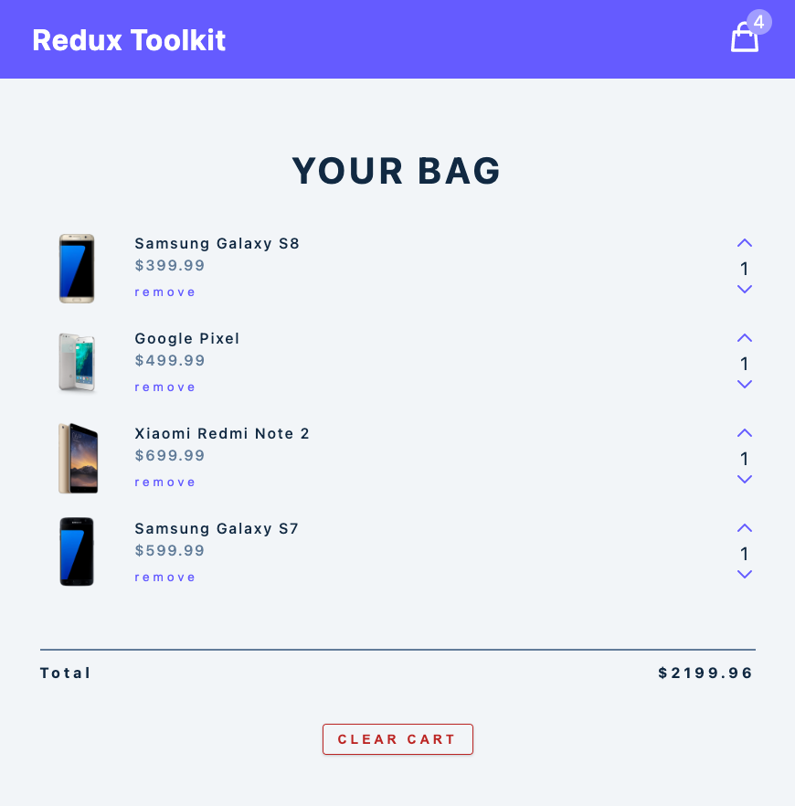

# Redux Toolkit

#### Project Overview

This is Redux Toolkit Course with React in youtube channel.
[Youtube URL](https://www.youtube.com/watch?v=bbkBuqC1rU4)

The course is good.

But if you don't know redux fandamental,I think you can not keep up the course.

So, I highly recommend you should take [Code evolution React Redux Course](https://www.youtube.com/watch?v=9boMnm5X9ak&list=PLC3y8-rFHvwheJHvseC3I0HuYI2f46oAK) firstly.

#### Purpose of the project

To learn Redux Tool Kit.

#### Screen Shot

#### What did I learn through the project?

I learned how to use redux toolkit and redux toolkit folder structure / fundamental convention.
